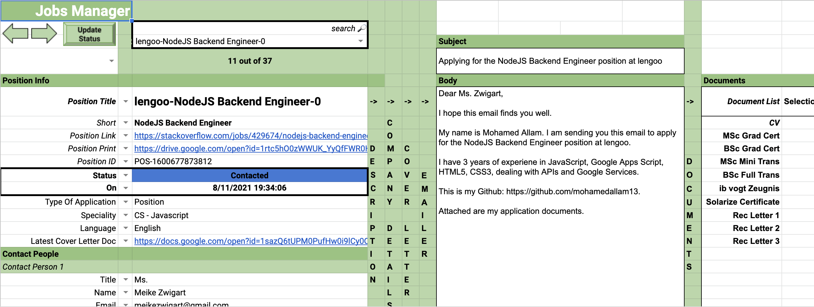

# gas-jobs-application-tracking
A tool created on Google Apps Script to automate the job applications process based on entries from Google Sheets, Docs and Forms




## Table of Contents

* [Technologies](#technologies)
* [Installation](#installation)
* [Features](#features)
* [Questions](#questions)


## Technologies 

* Google Apps Script
* JavaScript ES6
* HTML5
* CSS3
* Google Sheets
* Google Forms
* clasp

## Installation

To install this application, in VS code after cloning the repo, use [clasp CLI](https://developers.google.com/apps-script/guides/clasp) to create the .clasp.json file

```
clasp create [scriptTitle]
```

Then add the destination script id to the .clasp.json file and then push the code using the following command

```
clasp push
```

## Features

* Aggregate all jobs data through forms
* Create starter cover letter based on job title and industry of the company and other factors
* Bundles all documents in an email to send it out to hiring mamagers
* writes dates back to sheet for tracking
* Saves generated documents in Doc and PDF formats in Google Drive


## Questions 

If you have any more questions, please contact me here:

Github Username: [mohamedallam13](https://mohamedallam13.github.io/react-professional-portfolio/)

Email: [mohamedallam.tu@gmail.com](mailto:mohamedallam.tu@gmail.com)

